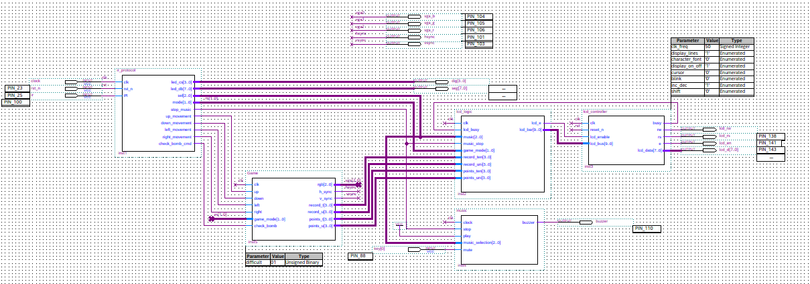

# Project Overview

```bash
project/
├── src/           # .v (Verilog source), .bdf (block diagrams) files and .cmp (Component files)
│   ├── top.v      # Top-level Entity
│   └── modules/   # Reusable modules
├── test/          # Unity tests
├── sim/           # Testbenches and simulation vectors (.vwf, .tbl)
├── constraints/   # Pinout files (.tcl, .acf)
├── docs/          # Schematics, specifications
├── output/        # Output folder to Quartus compilation
└── README.md
```

- Can use the ```src/top.v``` (Verilog file) or ```tests/subtop_test.bdf``` (Block Diagram file) to flash the firmware.

### Top RTL connection using Blocks Diagrams
[](docs/subtop_test.png)